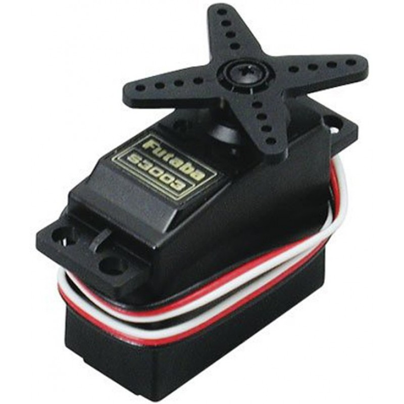
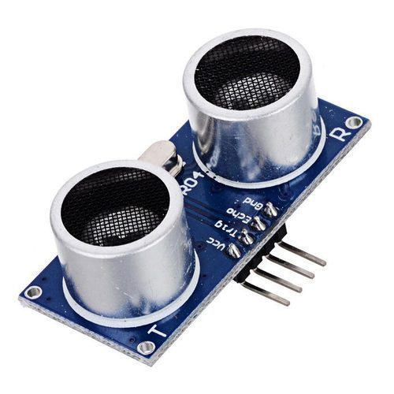
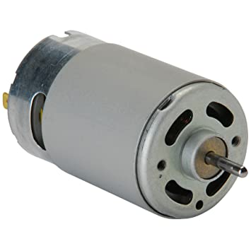

# Robot_Sheena

<!--lint ignore double-link-->

## **It's a Mobile controling Humanoid Robot**
 

### It's made by team [robosouls](https://www.facebook.com/robosouls).
1. [Shanjit Mandal, Circuit designer](https://www.facebook.com/shanjit.mondol.50)
2. [Jewel Nath, Programmer](https://www.facebook.com/dev.jewel.5/)
3. [Sayed](https://www.facebook.com/Sayedur0077)
4. [Niaz al Masum](https://www.facebook.com/niazal.masum)

 

## ⚡Here we used:

**Arduino Mega Microcontroler** 

 
**Servo Motors for hand and head movements**

 
**Ultrasonic Sensors**

 
**DC Motors for walking**

 
**LED**
 
**LCD Display**
 
**Google Assistant API for taliking**
 
**C++ Programming Language in arduino**
 
 
 

## ⚡It's able to - 
* **Salute anyone**
* **Handshake** 
* **Hand's up**
* **Right and Left hand various movements**
* **Answered any question using google API**
* **Go forward and backward**
* **Turn left and right**

## News Link:
* [Jamuna TV](https://www.youtube.com/watch?v=WyegetkAb0M)
* [Robosouls](https://fb.watch/4UbvpyVrjy/)
* [Channel 24](https://fb.watch/4UbxxDa6IR/)
* [bdnews24](https://fb.watch/4UbDYTbKmy/)

 
 

 
 
